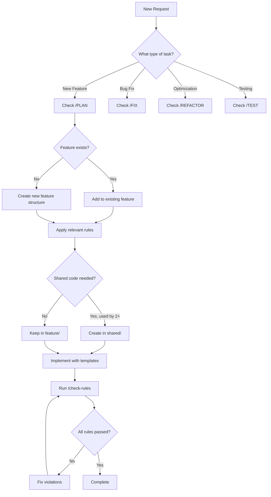

# Quick Reference Commands

```
/analyze [feature-name]     - Analyze existing feature structure
/implement [type] [name]    - Create new component/hook/util
/check-rules [categories]   - Verify rule compliance
/refactor [file]           - Suggest improvements
/test [component]          - Generate comprehensive tests
```

## Common Scenarios

### Scenario: "Create a form component"
**Apply Rules**: FA-1, CD-1, CD-2, TS-1, API-2, A11Y-2, T-1

**Template**:
```typescript
// features/[feature-name]/components/[Name]Form.tsx

import { useState } from 'react'
import type { [Model], [Model]FormData } from '../types'

interface [Name]FormProps {
  initialData?: Partial<[Model]FormData>
  onSubmit: (data: [Model]FormData) => Promise<void>
  onCancel?: () => void
}

export function [Name]Form({ initialData, onSubmit, onCancel }: [Name]FormProps) {
  const [formData, setFormData] = useState<[Model]FormData>(
    initialData || getEmptyFormData()
  )
  const [errors, setErrors] = useState<Partial<Record<keyof [Model]FormData, string>>>({})
  const [submitting, setSubmitting] = useState(false)

  const handleSubmit = async (e: React.FormEvent) => {
    e.preventDefault()
    
    const validationErrors = validate[Model](formData)
    if (Object.keys(validationErrors).length > 0) {
      setErrors(validationErrors)
      return
    }

    try {
      setSubmitting(true)
      setErrors({})
      await onSubmit(formData)
    } catch (error) {
      setErrors({ 
        submit: error instanceof Error ? error.message : 'Submission failed' 
      })
    } finally {
      setSubmitting(false)
    }
  }

  return (
    <form onSubmit={handleSubmit} noValidate>
      {/* Form fields with proper labels and error handling */}
      
      <div className="form-actions">
        <button 
          type="submit" 
          disabled={submitting}
          aria-busy={submitting}
        >
          {submitting ? 'Saving...' : 'Save'}
        </button>
        
        {onCancel && (
          <button type="button" onClick={onCancel}>
            Cancel
          </button>
        )}
      </div>
      
      {errors.submit && (
        <div role="alert" className="error-message">
          {errors.submit}
        </div>
      )}
    </form>
  )
}
```

### Scenario: "Add API integration"
**Apply Rules**: API-1, API-2, TS-7, EH-2, EH-6

**Template**:
```typescript
// features/[feature-name]/api/[name].api.ts

import type { ApiResponse, ApiError } from '@/shared/types/api'
import { apiClient } from '@/shared/utils/api-client'
import type { [Model], Create[Model]Request, Update[Model]Request } from '../types'

export class [Name]API {
  private readonly basePath = '/api/[plural-name]'

  async getAll(): Promise<[Model][]> {
    const response = await apiClient.get<ApiResponse<[Model][]>>(this.basePath)
    return response.data
  }

  async getById(id: [Model]Id): Promise<[Model]> {
    const response = await apiClient.get<ApiResponse<[Model]>>(
      `${this.basePath}/${id}`
    )
    return response.data
  }

  async create(data: Create[Model]Request): Promise<[Model]> {
    const response = await apiClient.post<ApiResponse<[Model]>>(
      this.basePath,
      data
    )
    return response.data
  }

  async update(id: [Model]Id, data: Update[Model]Request): Promise<[Model]> {
    const response = await apiClient.patch<ApiResponse<[Model]>>(
      `${this.basePath}/${id}`,
      data
    )
    return response.data
  }

  async delete(id: [Model]Id): Promise<void> {
    await apiClient.delete(`${this.basePath}/${id}`)
  }
}

export const [name]API = new [Name]API()

// Hook for data fetching
export function use[Name](id?: [Model]Id) {
  const [state, setState] = useState<{
    data: [Model] | [Model][] | null
    loading: boolean
    error: Error | null
  }>({
    data: null,
    loading: true,
    error: null
  })

  useEffect(() => {
    let cancelled = false

    async function fetchData() {
      try {
        setState(prev => ({ ...prev, loading: true, error: null }))
        
        const data = id 
          ? await [name]API.getById(id)
          : await [name]API.getAll()
        
        if (!cancelled) {
          setState({ data, loading: false, error: null })
        }
      } catch (error) {
        if (!cancelled) {
          setState({ 
            data: null, 
            loading: false, 
            error: error as Error 
          })
        }
      }
    }

    fetchData()
    return () => { cancelled = true }
  }, [id])

  return state
}
```

### Scenario: "Create reusable hook"
**Apply Rules**: CD-5, SM-1, TS-1, CQ-1

**Template**:
```typescript
// features/[feature-name]/hooks/use[Name].ts
// or shared/hooks/use[Name].ts if used by 2+ features

import { useState, useCallback, useEffect } from 'react'

interface Use[Name]Options {
  // Hook configuration options
}

interface Use[Name]Return {
  // What the hook returns
  data: DataType | null
  loading: boolean
  error: Error | null
  // Methods
  refetch: () => void
  reset: () => void
}

export function use[Name](options?: Use[Name]Options): Use[Name]Return {
  const [data, setData] = useState<DataType | null>(null)
  const [loading, setLoading}
```

### Scenario: "Component needs optimization"
**Apply Rules**: P-1, P-2, P-6, CQ-7

**Checklist**:
1. Profile first - don't optimize blindly
2. Check for unnecessary re-renders
3. Look for expensive computations
4. Verify large lists are virtualized
5. Check bundle size impact

**Example optimization**:
```typescript
// Before optimization
function ProductList({ products, filters }) {
  // This runs on every render
  const filteredProducts = products.filter(p => 
    p.category === filters.category && 
    p.price >= filters.minPrice
  )
  
  return (
    <div>
      {filteredProducts.map(product => (
        <ProductCard key={product.id} product={product} />
      ))}
    </div>
  )
}

// After optimization (if profiling shows it's needed)
function ProductList({ products, filters }) {
  // Only recalculate when inputs change
  const filteredProducts = useMemo(() => 
    products.filter(p => 
      p.category === filters.category && 
      p.price >= filters.minPrice
    ),
    [products, filters.category, filters.minPrice]
  )
  
  // Virtualize if list is large
  if (filteredProducts.length > 100) {
    return (
      <VirtualizedList
        items={filteredProducts}
        renderItem={(product) => (
          <ProductCard key={product.id} product={product} />
        )}
      />
    )
  }
  
  return (
    <div>
      {filteredProducts.map(product => (
        <ProductCard key={product.id} product={product} />
      ))}
    </div>
  )
}
```

## Verification Templates

### After Implementation Checklist
```
ARCHITECTURE
✓ Code organized in correct feature folder
✓ No direct imports between features
✓ Shared code used by 2+ features

TYPESCRIPT
✓ All data properly typed
✓ No 'any' types used
✓ API responses typed

COMPONENTS
✓ Single responsibility
✓ Props well-named
✓ Easily testable

STATE & API
✓ Loading states handled
✓ Error states handled
✓ Success feedback provided

QUALITY
✓ Error boundaries in place
✓ User-friendly error messages
✓ Keyboard navigation works
```

## Code Generation Templates

### 1. Feature Module Structure
When creating a new feature, generate this structure:

```typescript
// features/[feature-name]/index.ts - Public API
export { [Feature]Page } from './pages/[Feature]Page'
export { [Feature]Provider } from './providers/[Feature]Provider'
export type { [Feature]Context } from './types'

// features/[feature-name]/types/index.ts
export type [Model]Id = Brand<string, '[Model]Id'>

export type [Model] = {
  id: [Model]Id
  // ... fields
}

export type [Model]FormData = Omit<[Model], 'id' | 'createdAt' | 'updatedAt'>

// features/[feature-name]/pages/[Feature]Page.tsx
export function [Feature]Page() {
  return (
    <[Feature]Provider>
      <div className="[feature]-page">
        {/* Page content */}
      </div>
    </[Feature]Provider>
  )
}
```

### 2. Testing Template
```typescript
// Component test
describe('[ComponentName]', () => {
  it('renders correctly with required props', () => {
    render(<[ComponentName] requiredProp="value" />)
    expect(screen.getByRole('[role]')).toBeInTheDocument()
  })

  it('handles user interaction', async () => {
    const user = userEvent.setup()
    const handleClick = jest.fn()
    
    render(<[ComponentName] onClick={handleClick} />)
    
    await user.click(screen.getByRole('button'))
    
    expect(handleClick).toHaveBeenCalledTimes(1)
  })

  it('displays error state', () => {
    render(<[ComponentName] error={new Error('Test error')} />)
    expect(screen.getByRole('alert')).toHaveTextContent('Test error')
  })

  it('shows loading state', () => {
    render(<[ComponentName] loading />)
    expect(screen.getByLabelText('Loading')).toBeInTheDocument()
  })
})

// Hook test
describe('use[Name]', () => {
  it('fetches data on mount', async () => {
    const { result } = renderHook(() => use[Name]())
    
    expect(result.current.loading).toBe(true)
    
    await waitFor(() => {
      expect(result.current.loading).toBe(false)
    })
    
    expect(result.current.data).toBeDefined()
    expect(result.current.error).toBe(null)
  })

  it('handles errors gracefully', async () => {
    // Mock API to throw error
    server.use(
      rest.get('/api/[endpoint]', (req, res, ctx) => {
        return res(ctx.status(500))
      })
    )
    
    const { result } = renderHook(() => use[Name]())
    
    await waitFor(() => {
      expect(result.current.error).toBeDefined()
    })
    
    expect(result.current.data).toBe(null)
    expect(result.current.loading).toBe(false)
  })
})
```

## Real-World Examples

### Example 1: User Authentication Feature
```typescript
// features/auth/types/index.ts
export type UserId = Brand<string, 'UserId'>
export type AuthToken = Brand<string, 'AuthToken'>

export type User = {
  id: UserId
  email: string
  name: string
  role: 'admin' | 'user'
}

export type LoginCredentials = {
  email: string
  password: string
}

// features/auth/api/auth.api.ts
class AuthAPI {
  async login(credentials: LoginCredentials): Promise<{ user: User; token: AuthToken }> {
    const response = await apiClient.post<ApiResponse<{ user: User; token: string }>>(
      '/auth/login',
      credentials
    )
    return {
      user: response.data.user,
      token: response.data.token as AuthToken
    }
  }

  async logout(): Promise<void> {
    await apiClient.post('/auth/logout')
  }

  async getCurrentUser(): Promise<User> {
    const response = await apiClient.get<ApiResponse<User>>('/auth/me')
    return response.data
  }
}

// features/auth/hooks/useAuth.ts
export function useAuth() {
  const [user, setUser] = useState<User | null>(null)
  const [loading, setLoading] = useState(true)
  const [error, setError] = useState<Error | null>(null)

  const login = useCallback(async (credentials: LoginCredentials) => {
    try {
      setError(null)
      const { user, token } = await authAPI.login(credentials)
      
      // Store token securely (httpOnly cookie set by backend)
      setUser(user)
      
      return { success: true }
    } catch (err) {
      const error = err as Error
      setError(error)
      return { success: false, error }
    }
  }, [])

  const logout = useCallback(async () => {
    try {
      await authAPI.logout()
      setUser(null)
    } catch (err) {
      console.error('Logout failed:', err)
      // Still clear local state even if API call fails
      setUser(null)
    }
  }, [])

  useEffect(() => {
    let cancelled = false

    async function checkAuth() {
      try {
        const user = await authAPI.getCurrentUser()
        if (!cancelled) {
          setUser(user)
        }
      } catch {
        // Not authenticated
      } finally {
        if (!cancelled) {
          setLoading(false)
        }
      }
    }

    checkAuth()
    return () => { cancelled = true }
  }, [])

  return {
    user,
    loading,
    error,
    login,
    logout,
    isAuthenticated: !!user
  }
}
```

### Example 2: Data Table with Sorting and Filtering
```typescript
// features/products/components/ProductTable.tsx
interface ProductTableProps {
  products: Product[]
  onEdit?: (product: Product) => void
  onDelete?: (id: ProductId) => void
}

export function ProductTable({ products, onEdit, onDelete }: ProductTableProps) {
  const [sortConfig, setSortConfig] = useState<{
    key: keyof Product
    direction: 'asc' | 'desc'
  } | null>(null)
  
  const [filters, setFilters] = useState({
    search: '',
    category: 'all',
    minPrice: 0
  })

  // Memoize sorted and filtered data
  const processedProducts = useMemo(() => {
    let result = [...products]

    // Apply filters
    if (filters.search) {
      result = result.filter(p => 
        p.name.toLowerCase().includes(filters.search.toLowerCase())
      )
    }

    if (filters.category !== 'all') {
      result = result.filter(p => p.category === filters.category)
    }

    result = result.filter(p => p.price >= filters.minPrice)

    // Apply sorting
    if (sortConfig) {
      result.sort((a, b) => {
        const aValue = a[sortConfig.key]
        const bValue = b[sortConfig.key]
        
        if (aValue < bValue) {
          return sortConfig.direction === 'asc' ? -1 : 1
        }
        if (aValue > bValue) {
          return sortConfig.direction === 'asc' ? 1 : -1
        }
        return 0
      })
    }

    return result
  }, [products, filters, sortConfig])

  const handleSort = (key: keyof Product) => {
    setSortConfig(current => {
      if (!current || current.key !== key) {
        return { key, direction: 'asc' }
      }
      if (current.direction === 'asc') {
        return { key, direction: 'desc' }
      }
      return null
    })
  }

  return (
    <div className="product-table-container">
      <ProductTableFilters 
        filters={filters}
        onFiltersChange={setFilters}
      />
      
      <table className="product-table">
        <thead>
          <tr>
            <SortableHeader 
              label="Name" 
              sortKey="name"
              sortConfig={sortConfig}
              onSort={handleSort}
            />
            <SortableHeader 
              label="Category" 
              sortKey="category"
              sortConfig={sortConfig}
              onSort={handleSort}
            />
            <SortableHeader 
              label="Price" 
              sortKey="price"
              sortConfig={sortConfig}
              onSort={handleSort}
            />
            {(onEdit || onDelete) && <th>Actions</th>}
          </tr>
        </thead>
        <tbody>
          {processedProducts.map(product => (
            <ProductTableRow
              key={product.id}
              product={product}
              onEdit={onEdit}
              onDelete={onDelete}
            />
          ))}
        </tbody>
      </table>
      
      {processedProducts.length === 0 && (
        <EmptyState message="No products match your filters" />
      )}
    </div>
  )
}
```

## AI Agent Decision Tree



## Common Pitfalls to Avoid

1. **Over-engineering**
   - Don't create abstractions for single use cases
   - Don't add optimization without profiling
   - Don't make components overly configurable

2. **Under-engineering**
   - Don't skip error handling
   - Don't ignore loading states
   - Don't forget accessibility

3. **Architecture violations**
   - Don't import between features directly
   - Don't put feature-specific code in shared/
   - Don't mix concerns in components

4. **Type safety issues**
   - Don't use 'any' as an escape hatch
   - Don't skip API response typing
   - Don't ignore TypeScript errors

5. **Testing mistakes**
   - Don't test implementation details
   - Don't skip error case tests
   - Don't write brittle selectors

## Quick Decision Guide

**Should this go in shared/?**
- Used by 2+ features? → Yes
- Might be used by others? → No, wait until it is
- Generic utility? → Yes
- Feature-specific? → No

**Should I optimize this?**
- Measured performance issue? → Yes
- Seems slow? → Profile first
- Premature optimization? → No

**Should I add a prop?**
- Different use cases need it? → Yes
- Making it "flexible"? → No, use composition
- Required by consumer? → Yes

**Should I extract a hook?**
- Reusable logic? → Yes
- Just organizing code? → Maybe not
- Stateful logic used 2+ places? → Yes# 1. CORE RULES (core-rules.md)
*Always include this in every AI prompt - Maximum 30 lines*

```
## Frontend Feature-Based Architecture Core Rules

ARCHITECTURE:
- FA: Organize by feature (/features/[name]/), not file type
- FA: Shared code only if used by 2+ features (/shared/)
- FA: No direct imports between features

TYPESCRIPT:
- TS: Strict mode, prefer 'type' over 'interface'
- TS: Brand domain IDs: type UserId = Brand<string, 'UserId'>
- TS: No 'any', use 'unknown' for truly unknown types

COMPONENTS:
- CD: Single purpose, <300 lines, composition over props
- CD: Separate presentation from business logic
- CD: Extract hooks for reusable stateful logic

STATE & API:
- SM: Start local, lift only when needed
- API: Type all requests/responses, handle loading/error/success
- API: Never expose keys/tokens in frontend

QUALITY:
- EH: User-friendly errors, use Error Boundaries
- T: Test behavior not implementation
- A11Y: Semantic HTML, keyboard nav, proper contrast

VERIFY: After implementation, check applied rules with /check-rules
```

---

# 2. DETAILED GUIDELINES (detailed-guidelines.md)
*Reference document - Load sections as needed*

## Purpose
This document provides detailed explanations, examples, and rationale for each core rule. AI agents should reference specific sections when implementing features or when users need clarification.

## Table of Contents
1. [Architecture Rules (FA)](#architecture-rules)
2. [TypeScript Rules (TS)](#typescript-rules)
3. [Component Design (CD)](#component-design)
4. [State Management (SM)](#state-management)
5. [API & Data Fetching (API)](#api-data-fetching)
6. [Error Handling (EH)](#error-handling)
7. [Testing (T)](#testing)
8. [Performance (P)](#performance)
9. [Code Quality (CQ)](#code-quality)
10. [Accessibility (A11Y)](#accessibility)

---

## Architecture Rules

### FA-1: Feature-Based Organization
**Rule**: Organize code by feature, not by file type

**Why**: 
- Improves code discoverability
- Enables team ownership by feature
- Reduces merge conflicts
- Makes refactoring easier

**Example Structure**:
```
src/
├── features/
│   ├── user-profile/
│   │   ├── api/
│   │   │   ├── profile.api.ts
│   │   │   └── profile.types.ts
│   │   ├── components/
│   │   │   ├── ProfileCard.tsx
│   │   │   ├── ProfileForm.tsx
│   │   │   └── AvatarUpload.tsx
│   │   ├── hooks/
│   │   │   ├── useProfile.ts
│   │   │   └── useProfileUpdate.ts
│   │   ├── stores/
│   │   │   └── profile.store.ts
│   │   ├── utils/
│   │   │   └── validation.ts
│   │   └── index.ts  # Public API
│   └── dashboard/
├── shared/
│   ├── components/
│   │   ├── Button/
│   │   ├── Card/
│   │   └── Modal/
│   ├── hooks/
│   │   ├── useDebounce.ts
│   │   └── useLocalStorage.ts
│   └── utils/
│       └── formatters.ts
```

### FA-2: Shared Code Criteria
**Rule**: Place code in shared/ only if used by 2+ features

**Why**: Prevents premature abstraction and keeps features independent

**How to decide**:
1. Start in the feature that needs it
2. When another feature needs it, consider moving to shared
3. If only 2 features use it, consider if duplication is better

**Example**:
```typescript
// ❌ Bad: Moved to shared too early
// shared/components/UserAvatar.tsx

// ✅ Good: Keep in feature until needed elsewhere
// features/user-profile/components/Avatar.tsx

// When needed by features/comments/, then move to:
// shared/components/Avatar/
```

---

## TypeScript Rules

### TS-1: Strict Configuration
**Rule**: Use strict TypeScript configuration

**Required tsconfig.json settings**:
```json
{
  "compilerOptions": {
    "strict": true,
    "noImplicitAny": true,
    "strictNullChecks": true,
    "strictFunctionTypes": true,
    "strictBindCallApply": true,
    "strictPropertyInitialization": true,
    "noImplicitThis": true,
    "alwaysStrict": true,
    "noUnusedLocals": true,
    "noUnusedParameters": true,
    "noImplicitReturns": true,
    "noFallthroughCasesInSwitch": true
  }
}
```

### TS-2: Type vs Interface
**Rule**: Prefer 'type' over 'interface' unless interface merging is required

**Why**: Types are more flexible and consistent

**Examples**:
```typescript
// ✅ Good: Using type
type User = {
  id: string
  name: string
  email: string
}

type UserWithPosts = User & {
  posts: Post[]
}

// ❌ Avoid: Interface unless needed
interface IUser {
  id: string
  name: string
}

// ✅ Good: Interface when merging is needed
interface Window {
  myCustomGlobal: string
}
```

### TS-3: Branded Types
**Rule**: Use branded types for domain-specific values

**Implementation**:
```typescript
// Brand utility type
type Brand<T, TBrand> = T & { __brand: TBrand }

// Domain types
type UserId = Brand<string, 'UserId'>
type ProductId = Brand<string, 'ProductId'>
type Email = Brand<string, 'Email'>

// Usage
function getUser(id: UserId): User { /* ... */ }

// Type safety
const userId = 'user123' as UserId
const productId = 'prod456' as ProductId

getUser(userId) // ✅ OK
getUser(productId) // ❌ Type error
```

---

## Component Design

### CD-1: Single Purpose Components
**Rule**: Keep components small and single-purpose

**Why**: Easier to test, reuse, and understand

**Example**:
```typescript
// ❌ Bad: Multiple responsibilities
function UserProfile() {
  // Fetching data
  const [user, setUser] = useState()
  useEffect(() => { /* fetch */ }, [])
  
  // Form handling
  const [formData, setFormData] = useState()
  
  // Modal state
  const [showModal, setShowModal] = useState(false)
  
  // Everything mixed together
  return (
    <div>
      {/* Profile display */}
      {/* Edit form */}
      {/* Delete modal */}
    </div>
  )
}

// ✅ Good: Separated concerns
function UserProfile() {
  const { user, loading, error } = useUser()
  
  if (loading) return <ProfileSkeleton />
  if (error) return <ProfileError error={error} />
  
  return (
    <div>
      <ProfileDisplay user={user} />
      <ProfileActions userId={user.id} />
    </div>
  )
}

function ProfileDisplay({ user }: { user: User }) {
  return (/* Just display logic */)
}

function ProfileActions({ userId }: { userId: UserId }) {
  return (/* Just action buttons */)
}
```

### CD-2: Presentation vs Business Logic
**Rule**: Separate presentation components from business logic

**Pattern**:
```typescript
// Presentation Component (UI only)
interface ButtonProps {
  label: string
  onClick: () => void
  loading?: boolean
  variant?: 'primary' | 'secondary'
}

function Button({ label, onClick, loading, variant = 'primary' }: ButtonProps) {
  return (
    <button 
      className={`btn btn-${variant}`}
      onClick={onClick}
      disabled={loading}
    >
      {loading ? <Spinner /> : label}
    </button>
  )
}

// Business Logic Component (Container)
function SaveProfileButton() {
  const { saveProfile, saving } = useProfileActions()
  
  return (
    <Button
      label="Save Profile"
      onClick={saveProfile}
      loading={saving}
      variant="primary"
    />
  )
}
```

---

## State Management

### SM-1: Progressive State Lifting
**Rule**: Start with local component state, lift up only when needed

**Decision flow**:
```
1. Start with useState in component
2. If sibling needs it → lift to parent
3. If cousin needs it → consider context
4. If many components need it → global state
```

**Example progression**:
```typescript
// Step 1: Local state
function SearchBox() {
  const [query, setQuery] = useState('')
  return <input value={query} onChange={e => setQuery(e.target.value)} />
}

// Step 2: Lifted to parent (sibling needs it)
function SearchSection() {
  const [query, setQuery] = useState('')
  return (
    <>
      <SearchBox query={query} onQueryChange={setQuery} />
      <SearchResults query={query} />
    </>
  )
}

// Step 3: Context (multiple components need it)
const SearchContext = createContext<SearchContextType>(null)

function SearchProvider({ children }) {
  const [query, setQuery] = useState('')
  return (
    <SearchContext.Provider value={{ query, setQuery }}>
      {children}
    </SearchContext.Provider>
  )
}
```

### SM-2: Complex State Transitions
**Rule**: Use reducers for complex state transitions

**When to use reducer**:
- Multiple sub-values that change together
- Next state depends on previous state
- Complex update logic
- Need to track state history

**Example**:
```typescript
type FormState = {
  values: FormValues
  errors: FormErrors
  touched: Set<string>
  submitting: boolean
}

type FormAction =
  | { type: 'SET_FIELD'; field: string; value: any }
  | { type: 'SET_ERRORS'; errors: FormErrors }
  | { type: 'SUBMIT_START' }
  | { type: 'SUBMIT_SUCCESS' }
  | { type: 'SUBMIT_FAILURE'; error: Error }

function formReducer(state: FormState, action: FormAction): FormState {
  switch (action.type) {
    case 'SET_FIELD':
      return {
        ...state,
        values: { ...state.values, [action.field]: action.value },
        touched: new Set([...state.touched, action.field])
      }
    case 'SUBMIT_START':
      return { ...state, submitting: true, errors: {} }
    // ... other cases
  }
}
```

---

## API & Data Fetching

### API-1: Type All API Interfaces
**Rule**: Type all API request and response interfaces

**Example**:
```typescript
// API Types
type CreateUserRequest = {
  name: string
  email: Email
  role: UserRole
}

type CreateUserResponse = {
  user: User
  token: string
}

type ApiError = {
  code: string
  message: string
  details?: Record<string, string>
}

// API Client
class UserAPI {
  async createUser(data: CreateUserRequest): Promise<CreateUserResponse> {
    const response = await fetch('/api/users', {
      method: 'POST',
      headers: { 'Content-Type': 'application/json' },
      body: JSON.stringify(data)
    })
    
    if (!response.ok) {
      const error: ApiError = await response.json()
      throw new ApiException(error)
    }
    
    return response.json()
  }
}
```

### API-2: Handle All Async States
**Rule**: Handle loading, error, and success states for all async operations

**Pattern**:
```typescript
function useUser(userId: UserId) {
  const [state, setState] = useState<{
    data: User | null
    loading: boolean
    error: Error | null
  }>({
    data: null,
    loading: true,
    error: null
  })

  useEffect(() => {
    let cancelled = false

    async function fetchUser() {
      try {
        setState(prev => ({ ...prev, loading: true, error: null }))
        const user = await userAPI.getUser(userId)
        
        if (!cancelled) {
          setState({ data: user, loading: false, error: null })
        }
      } catch (error) {
        if (!cancelled) {
          setState({ data: null, loading: false, error: error as Error })
        }
      }
    }

    fetchUser()
    return () => { cancelled = true }
  }, [userId])

  return state
}

// Usage
function UserProfile({ userId }: { userId: UserId }) {
  const { data: user, loading, error } = useUser(userId)

  if (loading) return <ProfileSkeleton />
  if (error) return <ErrorMessage error={error} />
  if (!user) return <NotFound />
  
  return <Profile user={user} />
}
```

---

## Error Handling

### EH-1: Error Boundaries
**Rule**: Use Error Boundaries to catch React component errors

**Implementation**:
```typescript
class ErrorBoundary extends Component<
  { children: ReactNode; fallback: ComponentType<{ error: Error }> },
  { hasError: boolean; error: Error | null }
> {
  state = { hasError: false, error: null }

  static getDerivedStateFromError(error: Error) {
    return { hasError: true, error }
  }

  componentDidCatch(error: Error, errorInfo: ErrorInfo) {
    console.error('Error caught by boundary:', error, errorInfo)
    // Send to error tracking service
    errorTracker.captureException(error, { extra: errorInfo })
  }

  render() {
    if (this.state.hasError && this.state.error) {
      const Fallback = this.props.fallback
      return <Fallback error={this.state.error} />
    }

    return this.props.children
  }
}

// Usage
function App() {
  return (
    <ErrorBoundary fallback={AppErrorFallback}>
      <Router>
        <Routes>
          {/* Your routes */}
        </Routes>
      </Router>
    </ErrorBoundary>
  )
}
```

### EH-2: useEffect Error Handling
**Rule**: Handle async errors in useEffect properly

**Pattern**:
```typescript
useEffect(() => {
  let mounted = true

  async function loadData() {
    try {
      const data = await fetchData()
      if (mounted) {
        setData(data)
      }
    } catch (error) {
      if (mounted) {
        setError(error as Error)
        // Don't just console.log - handle the error!
        showErrorNotification({
          message: 'Failed to load data',
          action: { label: 'Retry', onClick: loadData }
        })
      }
    }
  }

  loadData()
  
  return () => { mounted = false }
}, [deps])
```

---

## Testing

### T-1: Test Behavior, Not Implementation
**Rule**: Test user behavior, not implementation details

**Examples**:
```typescript
// ❌ Bad: Testing implementation
test('should call setUser with new data', () => {
  const setUser = jest.fn()
  const { getByRole } = render(<UserForm setUser={setUser} />)
  
  fireEvent.change(getByRole('textbox', { name: /name/i }), {
    target: { value: 'John' }
  })
  
  expect(setUser).toHaveBeenCalledWith({ name: 'John' })
})

// ✅ Good: Testing behavior
test('user can update their profile', async () => {
  const user = userEvent.setup()
  render(<UserProfile />)
  
  // User clicks edit
  await user.click(screen.getByRole('button', { name: /edit profile/i }))
  
  // User updates name
  const nameInput = screen.getByLabelText(/name/i)
  await user.clear(nameInput)
  await user.type(nameInput, 'John Doe')
  
  // User saves
  await user.click(screen.getByRole('button', { name: /save/i }))
  
  // Verify the result the user sees
  expect(await screen.findByText('Profile updated successfully')).toBeInTheDocument()
  expect(screen.getByText('John Doe')).toBeInTheDocument()
})
```

### T-2: Integration Tests for Features
**Rule**: Write integration tests for complete user flows

**Example**:
```typescript
describe('User Registration Flow', () => {
  test('new user can successfully register and access dashboard', async () => {
    const user = userEvent.setup()
    
    // Start at registration
    render(<App />, { route: '/register' })
    
    // Fill registration form
    await user.type(screen.getByLabelText(/email/i), 'user@example.com')
    await user.type(screen.getByLabelText(/password/i), 'SecurePass123!')
    await user.type(screen.getByLabelText(/confirm password/i), 'SecurePass123!')
    
    // Submit form
    await user.click(screen.getByRole('button', { name: /create account/i }))
    
    // Verify redirect to dashboard
    await waitFor(() => {
      expect(window.location.pathname).toBe('/dashboard')
    })
    
    // Verify user sees welcome message
    expect(await screen.findByText(/welcome, user@example\.com/i)).toBeInTheDocument()
    
    // Verify user data is loaded
    expect(await screen.findByText(/your projects/i)).toBeInTheDocument()
  })
})
```

---

## Performance

### P-1: Strategic React.memo
**Rule**: Use React.memo only when profiling shows it's beneficial

**When to use**:
1. Component renders frequently with same props
2. Component has expensive render logic
3. Parent re-renders often but child's props rarely change

**Example**:
```typescript
// ❌ Bad: Memo everything
const Button = memo(({ label, onClick }) => (
  <button onClick={onClick}>{label}</button>
))

// ✅ Good: Memo when beneficial
const ExpensiveChart = memo(({ data, options }) => {
  // Complex calculations
  const processedData = useMemo(() => 
    processChartData(data, options), [data, options]
  )
  
  return <ChartLibrary data={processedData} />
}, (prevProps, nextProps) => {
  // Custom comparison if needed
  return (
    prevProps.data.id === nextProps.data.id &&
    prevProps.options.theme === nextProps.options.theme
  )
})
```

### P-2: Strategic Memoization
**Rule**: Apply useMemo and useCallback strategically

**Guidelines**:
```typescript
// ❌ Bad: Over-memoization
function Component() {
  const value = useMemo(() => 1 + 1, []) // Unnecessary
  const handler = useCallback(() => console.log('click'), []) // Probably unnecessary
}

// ✅ Good: Strategic memoization
function DataGrid({ rows, columns }) {
  // Expensive computation
  const sortedData = useMemo(() => 
    sortDataByColumns(rows, columns), 
    [rows, columns]
  )
  
  // Callback passed to many children
  const handleCellEdit = useCallback((rowId: string, field: string, value: any) => {
    updateRow(rowId, { [field]: value })
  }, [updateRow])
  
  return (
    <Grid 
      data={sortedData} 
      onCellEdit={handleCellEdit}
    />
  )
}
```

---

## Code Quality

### CQ-1: Naming Conventions
**Rule**: Use consistent naming conventions

**Standards**:
```typescript
// Files
UserProfile.tsx          // React components (PascalCase)
useUserData.ts          // Hooks (camelCase with 'use' prefix)
userProfile.utils.ts    // Utilities (camelCase)
UserProfile.test.tsx    // Tests (match source file)
user.types.ts           // Type definitions (contextual)

// Variables
const MAX_RETRY_COUNT = 3        // Constants (UPPER_SNAKE_CASE)
const userId: UserId             // Variables (camelCase)
const isLoading: boolean         // Booleans (is/has/should prefix)

// Functions
function calculateTotalPrice() {} // Actions (verb)
function getUserById() {}         // Getters (get prefix)
function isValidEmail() {}        // Predicates (is/has prefix)

// Types/Interfaces
type User = {}                   // Types (PascalCase)
type UserMap = Map<UserId, User> // Descriptive type names

// React Components
function UserProfile() {}        // Components (PascalCase)
function useUserData() {}        // Hooks (camelCase with 'use')
```

### CQ-2: Pure Functions
**Rule**: Keep functions pure and testable where possible

**Example**:
```typescript
// ❌ Impure function
let userCount = 0
function createUser(name: string) {
  userCount++ // Side effect
  const timestamp = Date.now() // Non-deterministic
  return {
    id: `user_${userCount}`,
    name,
    createdAt: timestamp
  }
}

// ✅ Pure function
function createUser(
  name: string, 
  idGenerator: () => string,
  timestamp: number
): User {
  return {
    id: idGenerator(),
    name,
    createdAt: timestamp
  }
}

// Usage
const user = createUser(
  'John',
  () => generateUserId(),
  Date.now()
)
```

---

## Accessibility

### A11Y-1: Semantic HTML
**Rule**: Use semantic HTML elements appropriately

**Examples**:
```typescript
// ❌ Bad: Divs for everything
<div onClick={handleClick}>Click me</div>
<div className="header">
  <div className="nav">...</div>
</div>

// ✅ Good: Semantic elements
<button onClick={handleClick}>Click me</button>
<header>
  <nav aria-label="Main navigation">
    <ul>
      <li><a href="/home">Home</a></li>
      <li><a href="/about">About</a></li>
    </ul>
  </nav>
</header>

// Form example
<form onSubmit={handleSubmit}>
  <fieldset>
    <legend>Personal Information</legend>
    
    <label htmlFor="name">
      Name <span aria-label="required">*</span>
    </label>
    <input 
      id="name" 
      type="text" 
      required 
      aria-describedby="name-error"
    />
    <span id="name-error" role="alert" aria-live="polite">
      {errors.name}
    </span>
  </fieldset>
</form>
```

### A11Y-2: Interactive Elements
**Rule**: Ensure keyboard navigation and screen reader support

**Implementation**:
```typescript
function AccessibleModal({ isOpen, onClose, title, children }) {
  const closeButtonRef = useRef<HTMLButtonElement>(null)
  
  // Trap focus within modal
  useEffect(() => {
    if (isOpen) {
      closeButtonRef.current?.focus()
    }
  }, [isOpen])
  
  if (!isOpen) return null
  
  return (
    <div
      role="dialog"
      aria-modal="true"
      aria-labelledby="modal-title"
      onKeyDown={(e) => {
        if (e.key === 'Escape') onClose()
      }}
    >
      <div className="modal-backdrop" onClick={onClose} />
      <div className="modal-content">
        <h2 id="modal-title">{title}</h2>
        <button
          ref={closeButtonRef}
          onClick={onClose}
          aria-label="Close dialog"
          className="close-button"
        >
          ×
        </button>
        {children}
      </div>
    </div>
  )
}
```

---

# 3. AI AGENT PLAYBOOK (ai-agent-playbook.md)
*Task-specific guidance and templates for AI agents*

## Quick Reference Commands

```
/analyze [feature-name]     - Analyze existing feature structure
/implement [type] [name]    - Create new component/hook/util
/check-rules [categories]   - Verify rule compliance
/refactor [file]           - Suggest improvements
/test [component]          - Generate comprehensive tests
```

## Common Scenarios

### Scenario: "Create a form component"
**Apply Rules**: FA-1, CD-1, CD-2, TS-1, API-2, A11Y-2, T-1

**Template**:
```typescript
// features/[feature-name]/components/[Name]Form.tsx

import { useState } from 'react'
import type { [Model], [Model]FormData } from '../types'

interface [Name]FormProps {
  initialData?: Partial<[Model]FormData>
  onSubmit: (data: [Model]FormData) => Promise<void>
  onCancel?: () => void
}

export function [Name]Form({ initialData, onSubmit, onCancel }: [Name]FormProps) {
  const [formData, setFormData] = useState<[Model]FormData>(
    initialData || getEmptyFormData()
  )
  const [errors, setErrors] = useState<Partial<Record<keyof [Model]FormData, string>>>({})
  const [submitting, setSubmitting] = useState(false)

  const handleSubmit = async (e: React.FormEvent) => {
    e.preventDefault()
    
    const validationErrors = validate[Model](formData)
    if (Object.keys(validationErrors).length > 0) {
      setErrors(validationErrors)
      return
    }

    try {
      setSubmitting(true)
      setErrors({})
      await onSubmit(formData)
    } catch (error) {
      setErrors({ 
        submit: error instanceof Error ? error.message : 'Submission failed' 
      })
    } finally {
      setSubmitting(false)
    }
  }

  return (
    <form onSubmit={handleSubmit} noValidate>
      {/* Form fields with proper labels and error handling */}
      
      <div className="form-actions">
        <button 
          type="submit" 
          disabled={submitting}
          aria-busy={submitting}
        >
          {submitting ? 'Saving...' : 'Save'}
        </button>
        
        {onCancel && (
          <button type="button" onClick={onCancel}>
            Cancel
          </button>
        )}
      </div>
      
      {errors.submit && (
        <div role="alert" className="error-message">
          {errors.submit}
        </div>
      )}
    </form>
  )
}
```

### Scenario: "Add API integration"
**Apply Rules**: API-1, API-2, TS-7, EH-2, EH-6

**Template**:
```typescript
// features/[feature-name]/api/[name].api.ts

import type { ApiResponse, ApiError } from '@/shared/types/api'
import { apiClient } from '@/shared/utils/api-client'
import type { [Model], Create[Model]Request, Update[Model]Request } from '../types'

export class [Name]API {
  private readonly basePath = '/api/[plural-name]'

  async getAll(): Promise<[Model][]> {
    const response = await apiClient.get<ApiResponse<[Model][]>>(this.basePath)
    return response.data
  }

  async getById(id: [Model]Id): Promise<[Model]> {
    const response = await apiClient.get<ApiResponse<[Model]>>(
      `${this.basePath}/${id}`
    )
    return response.data
  }

  async create(data: Create[Model]Request): Promise<[Model]> {
    const response = await apiClient.post<ApiResponse<[Model]>>(
      this.basePath,
      data
    )
    return response.data
  }

  async update(id: [Model]Id, data: Update[Model]Request): Promise<[Model]> {
    const response = await apiClient.patch<ApiResponse<[Model]>>(
      `${this.basePath}/${id}`,
      data
    )
    return response.data
  }

  async delete(id: [Model]Id): Promise<void> {
    await apiClient.delete(`${this.basePath}/${id}`)
  }
}

export const [name]API = new [Name]API()

// Hook for data fetching
export function use[Name](id?: [Model]Id) {
  const [state, setState] = useState<{
    data: [Model] | [Model][] | null
    loading: boolean
    error: Error | null
  }>({
    data: null,
    loading: true,
    error: null
  })

  useEffect(() => {
    let cancelled = false

    async function fetchData() {
      try {
        setState(prev => ({ ...prev, loading: true, error: null }))
        
        const data = id 
          ? await [name]API.getById(id)
          : await [name]API.getAll()
        
        if (!cancelled) {
          setState({ data, loading: false, error: null })
        }
      } catch (error) {
        if (!cancelled) {
          setState({ 
            data: null, 
            loading: false, 
            error: error as Error 
          })
        }
      }
    }

    fetchData()
    return () => { cancelled = true }
  }, [id])

  return state
}
```

### Scenario: "Create reusable hook"
**Apply Rules**: CD-5, SM-1, TS-1, CQ-1

**Template**:
```typescript
// features/[feature-name]/hooks/use[Name].ts
// or shared/hooks/use[Name].ts if used by 2+ features

import { useState, useCallback, useEffect } from 'react'

interface Use[Name]Options {
  // Hook configuration options
}

interface Use[Name]Return {
  // What the hook returns
  data: DataType | null
  loading: boolean
  error: Error | null
  // Methods
  refetch: () => void
  reset: () => void
}

export function use[Name](options?: Use[Name]Options): Use[Name]Return {
  const [data, setData] = useState<DataType | null>(null)
  const [loading, setLoading] = useState(false)
  const [error, setError] = useState<Error | null>(null)

  const fetchData = useCallback(async () => {
    try {
      setLoading(true)
      setError(null)
      
      // Your async logic here
      const result = await someAsyncOperation()
      
      setData(result)
    } catch (err) {
      setError(err as Error)
    } finally {
      setLoading(false)
    }
  }, [/* dependencies */])

  const reset = useCallback(() => {
    setData(null)
    setError(null)
    setLoading(false)
  }, [])

  useEffect(() => {
    fetchData()
  }, [fetchData])

  return {
    data,
    loading,
    error,
    refetch: fetchData,
    reset
  }
}
