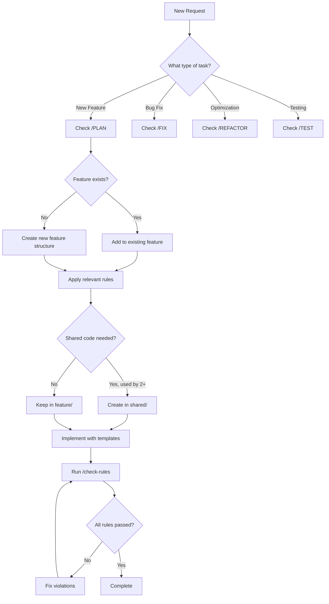

# Quick Reference Commands

```
/analyze [feature-name]     - Analyze existing feature structure
/implement [type] [name]    - Create new component/hook/util
/check-rules [categories]   - Verify rule compliance
/refactor [file]           - Suggest improvements
/test [component]          - Generate comprehensive tests
```

## Common Scenarios

### Scenario: "Create a form component"
**Apply Rules**: FA-1, CD-1, CD-2, TS-1, API-2, A11Y-2, T-1

**Template**:
```typescript
// features/[feature-name]/components/[Name]Form.tsx

import { useState } from 'react'
import type { [Model], [Model]FormData } from '../types'

interface [Name]FormProps {
  initialData?: Partial<[Model]FormData>
  onSubmit: (data: [Model]FormData) => Promise<void>
  onCancel?: () => void
}

export function [Name]Form({ initialData, onSubmit, onCancel }: [Name]FormProps) {
  const [formData, setFormData] = useState<[Model]FormData>(
    initialData || getEmptyFormData()
  )
  const [errors, setErrors] = useState<Partial<Record<keyof [Model]FormData, string>>>({})
  const [submitting, setSubmitting] = useState(false)

  const handleSubmit = async (e: React.FormEvent) => {
    e.preventDefault()
    
    const validationErrors = validate[Model](formData)
    if (Object.keys(validationErrors).length > 0) {
      setErrors(validationErrors)
      return
    }

    try {
      setSubmitting(true)
      setErrors({})
      await onSubmit(formData)
    } catch (error) {
      setErrors({ 
        submit: error instanceof Error ? error.message : 'Submission failed' 
      })
    } finally {
      setSubmitting(false)
    }
  }

  return (
    <form onSubmit={handleSubmit} noValidate>
      {/* Form fields with proper labels and error handling */}
      
      <div className="form-actions">
        <button 
          type="submit" 
          disabled={submitting}
          aria-busy={submitting}
        >
          {submitting ? 'Saving...' : 'Save'}
        </button>
        
        {onCancel && (
          <button type="button" onClick={onCancel}>
            Cancel
          </button>
        )}
      </div>
      
      {errors.submit && (
        <div role="alert" className="error-message">
          {errors.submit}
        </div>
      )}
    </form>
  )
}
```

### Scenario: "Add API integration"
**Apply Rules**: API-1, API-2, TS-7, EH-2, EH-6

**Template**:
```typescript
// features/[feature-name]/api/[name].api.ts

import type { ApiResponse, ApiError } from '@/shared/types/api'
import { apiClient } from '@/shared/utils/api-client'
import type { [Model], Create[Model]Request, Update[Model]Request } from '../types'

export class [Name]API {
  private readonly basePath = '/api/[plural-name]'

  async getAll(): Promise<[Model][]> {
    const response = await apiClient.get<ApiResponse<[Model][]>>(this.basePath)
    return response.data
  }

  async getById(id: [Model]Id): Promise<[Model]> {
    const response = await apiClient.get<ApiResponse<[Model]>>(
      `${this.basePath}/${id}`
    )
    return response.data
  }

  async create(data: Create[Model]Request): Promise<[Model]> {
    const response = await apiClient.post<ApiResponse<[Model]>>(
      this.basePath,
      data
    )
    return response.data
  }

  async update(id: [Model]Id, data: Update[Model]Request): Promise<[Model]> {
    const response = await apiClient.patch<ApiResponse<[Model]>>(
      `${this.basePath}/${id}`,
      data
    )
    return response.data
  }

  async delete(id: [Model]Id): Promise<void> {
    await apiClient.delete(`${this.basePath}/${id}`)
  }
}

export const [name]API = new [Name]API()

// Hook for data fetching
export function use[Name](id?: [Model]Id) {
  const [state, setState] = useState<{
    data: [Model] | [Model][] | null
    loading: boolean
    error: Error | null
  }>({
    data: null,
    loading: true,
    error: null
  })

  useEffect(() => {
    let cancelled = false

    async function fetchData() {
      try {
        setState(prev => ({ ...prev, loading: true, error: null }))
        
        const data = id 
          ? await [name]API.getById(id)
          : await [name]API.getAll()
        
        if (!cancelled) {
          setState({ data, loading: false, error: null })
        }
      } catch (error) {
        if (!cancelled) {
          setState({ 
            data: null, 
            loading: false, 
            error: error as Error 
          })
        }
      }
    }

    fetchData()
    return () => { cancelled = true }
  }, [id])

  return state
}
```

### Scenario: "Create reusable hook"
**Apply Rules**: CD-5, SM-1, TS-1, CQ-1

**Template**:
```typescript
// features/[feature-name]/hooks/use[Name].ts
// or shared/hooks/use[Name].ts if used by 2+ features

import { useState, useCallback, useEffect } from 'react'

interface Use[Name]Options {
  // Hook configuration options
}

interface Use[Name]Return {
  // What the hook returns
  data: DataType | null
  loading: boolean
  error: Error | null
  // Methods
  refetch: () => void
  reset: () => void
}

export function use[Name](options?: Use[Name]Options): Use[Name]Return {
  const [data, setData] = useState<DataType | null>(null)
  const [loading, setLoading}
```

### Scenario: "Component needs optimization"
**Apply Rules**: P-1, P-2, P-6, CQ-7

**Checklist**:
1. Profile first - don't optimize blindly
2. Check for unnecessary re-renders
3. Look for expensive computations
4. Verify large lists are virtualized
5. Check bundle size impact

**Example optimization**:
```typescript
// Before optimization
function ProductList({ products, filters }) {
  // This runs on every render
  const filteredProducts = products.filter(p => 
    p.category === filters.category && 
    p.price >= filters.minPrice
  )
  
  return (
    <div>
      {filteredProducts.map(product => (
        <ProductCard key={product.id} product={product} />
      ))}
    </div>
  )
}

// After optimization (if profiling shows it's needed)
function ProductList({ products, filters }) {
  // Only recalculate when inputs change
  const filteredProducts = useMemo(() => 
    products.filter(p => 
      p.category === filters.category && 
      p.price >= filters.minPrice
    ),
    [products, filters.category, filters.minPrice]
  )
  
  // Virtualize if list is large
  if (filteredProducts.length > 100) {
    return (
      <VirtualizedList
        items={filteredProducts}
        renderItem={(product) => (
          <ProductCard key={product.id} product={product} />
        )}
      />
    )
  }
  
  return (
    <div>
      {filteredProducts.map(product => (
        <ProductCard key={product.id} product={product} />
      ))}
    </div>
  )
}
```

## Verification Templates

### After Implementation Checklist
```
ARCHITECTURE
✓ Code organized in correct feature folder
✓ No direct imports between features
✓ Shared code used by 2+ features

TYPESCRIPT
✓ All data properly typed
✓ No 'any' types used
✓ API responses typed

COMPONENTS
✓ Single responsibility
✓ Props well-named
✓ Easily testable

STATE & API
✓ Loading states handled
✓ Error states handled
✓ Success feedback provided

QUALITY
✓ Error boundaries in place
✓ User-friendly error messages
✓ Keyboard navigation works
```

## Code Generation Templates

### 1. Feature Module Structure
When creating a new feature, generate this structure:

```typescript
// features/[feature-name]/index.ts - Public API
export { [Feature]Page } from './pages/[Feature]Page'
export { [Feature]Provider } from './providers/[Feature]Provider'
export type { [Feature]Context } from './types'

// features/[feature-name]/types/index.ts
export type [Model]Id = Brand<string, '[Model]Id'>

export type [Model] = {
  id: [Model]Id
  // ... fields
}

export type [Model]FormData = Omit<[Model], 'id' | 'createdAt' | 'updatedAt'>

// features/[feature-name]/pages/[Feature]Page.tsx
export function [Feature]Page() {
  return (
    <[Feature]Provider>
      <div className="[feature]-page">
        {/* Page content */}
      </div>
    </[Feature]Provider>
  )
}
```

### 2. Testing Template
```typescript
// Component test
describe('[ComponentName]', () => {
  it('renders correctly with required props', () => {
    render(<[ComponentName] requiredProp="value" />)
    expect(screen.getByRole('[role]')).toBeInTheDocument()
  })

  it('handles user interaction', async () => {
    const user = userEvent.setup()
    const handleClick = jest.fn()
    
    render(<[ComponentName] onClick={handleClick} />)
    
    await user.click(screen.getByRole('button'))
    
    expect(handleClick).toHaveBeenCalledTimes(1)
  })

  it('displays error state', () => {
    render(<[ComponentName] error={new Error('Test error')} />)
    expect(screen.getByRole('alert')).toHaveTextContent('Test error')
  })

  it('shows loading state', () => {
    render(<[ComponentName] loading />)
    expect(screen.getByLabelText('Loading')).toBeInTheDocument()
  })
})

// Hook test
describe('use[Name]', () => {
  it('fetches data on mount', async () => {
    const { result } = renderHook(() => use[Name]())
    
    expect(result.current.loading).toBe(true)
    
    await waitFor(() => {
      expect(result.current.loading).toBe(false)
    })
    
    expect(result.current.data).toBeDefined()
    expect(result.current.error).toBe(null)
  })

  it('handles errors gracefully', async () => {
    // Mock API to throw error
    server.use(
      rest.get('/api/[endpoint]', (req, res, ctx) => {
        return res(ctx.status(500))
      })
    )
    
    const { result } = renderHook(() => use[Name]())
    
    await waitFor(() => {
      expect(result.current.error).toBeDefined()
    })
    
    expect(result.current.data).toBe(null)
    expect(result.current.loading).toBe(false)
  })
})
```

## Real-World Examples

### Example 1: User Authentication Feature
```typescript
// features/auth/types/index.ts
export type UserId = Brand<string, 'UserId'>
export type AuthToken = Brand<string, 'AuthToken'>

export type User = {
  id: UserId
  email: string
  name: string
  role: 'admin' | 'user'
}

export type LoginCredentials = {
  email: string
  password: string
}

// features/auth/api/auth.api.ts
class AuthAPI {
  async login(credentials: LoginCredentials): Promise<{ user: User; token: AuthToken }> {
    const response = await apiClient.post<ApiResponse<{ user: User; token: string }>>(
      '/auth/login',
      credentials
    )
    return {
      user: response.data.user,
      token: response.data.token as AuthToken
    }
  }

  async logout(): Promise<void> {
    await apiClient.post('/auth/logout')
  }

  async getCurrentUser(): Promise<User> {
    const response = await apiClient.get<ApiResponse<User>>('/auth/me')
    return response.data
  }
}

// features/auth/hooks/useAuth.ts
export function useAuth() {
  const [user, setUser] = useState<User | null>(null)
  const [loading, setLoading] = useState(true)
  const [error, setError] = useState<Error | null>(null)

  const login = useCallback(async (credentials: LoginCredentials) => {
    try {
      setError(null)
      const { user, token } = await authAPI.login(credentials)
      
      // Store token securely (httpOnly cookie set by backend)
      setUser(user)
      
      return { success: true }
    } catch (err) {
      const error = err as Error
      setError(error)
      return { success: false, error }
    }
  }, [])

  const logout = useCallback(async () => {
    try {
      await authAPI.logout()
      setUser(null)
    } catch (err) {
      console.error('Logout failed:', err)
      // Still clear local state even if API call fails
      setUser(null)
    }
  }, [])

  useEffect(() => {
    let cancelled = false

    async function checkAuth() {
      try {
        const user = await authAPI.getCurrentUser()
        if (!cancelled) {
          setUser(user)
        }
      } catch {
        // Not authenticated
      } finally {
        if (!cancelled) {
          setLoading(false)
        }
      }
    }

    checkAuth()
    return () => { cancelled = true }
  }, [])

  return {
    user,
    loading,
    error,
    login,
    logout,
    isAuthenticated: !!user
  }
}
```

### Example 2: Data Table with Sorting and Filtering
```typescript
// features/products/components/ProductTable.tsx
interface ProductTableProps {
  products: Product[]
  onEdit?: (product: Product) => void
  onDelete?: (id: ProductId) => void
}

export function ProductTable({ products, onEdit, onDelete }: ProductTableProps) {
  const [sortConfig, setSortConfig] = useState<{
    key: keyof Product
    direction: 'asc' | 'desc'
  } | null>(null)
  
  const [filters, setFilters] = useState({
    search: '',
    category: 'all',
    minPrice: 0
  })

  // Memoize sorted and filtered data
  const processedProducts = useMemo(() => {
    let result = [...products]

    // Apply filters
    if (filters.search) {
      result = result.filter(p => 
        p.name.toLowerCase().includes(filters.search.toLowerCase())
      )
    }

    if (filters.category !== 'all') {
      result = result.filter(p => p.category === filters.category)
    }

    result = result.filter(p => p.price >= filters.minPrice)

    // Apply sorting
    if (sortConfig) {
      result.sort((a, b) => {
        const aValue = a[sortConfig.key]
        const bValue = b[sortConfig.key]
        
        if (aValue < bValue) {
          return sortConfig.direction === 'asc' ? -1 : 1
        }
        if (aValue > bValue) {
          return sortConfig.direction === 'asc' ? 1 : -1
        }
        return 0
      })
    }

    return result
  }, [products, filters, sortConfig])

  const handleSort = (key: keyof Product) => {
    setSortConfig(current => {
      if (!current || current.key !== key) {
        return { key, direction: 'asc' }
      }
      if (current.direction === 'asc') {
        return { key, direction: 'desc' }
      }
      return null
    })
  }

  return (
    <div className="product-table-container">
      <ProductTableFilters 
        filters={filters}
        onFiltersChange={setFilters}
      />
      
      <table className="product-table">
        <thead>
          <tr>
            <SortableHeader 
              label="Name" 
              sortKey="name"
              sortConfig={sortConfig}
              onSort={handleSort}
            />
            <SortableHeader 
              label="Category" 
              sortKey="category"
              sortConfig={sortConfig}
              onSort={handleSort}
            />
            <SortableHeader 
              label="Price" 
              sortKey="price"
              sortConfig={sortConfig}
              onSort={handleSort}
            />
            {(onEdit || onDelete) && <th>Actions</th>}
          </tr>
        </thead>
        <tbody>
          {processedProducts.map(product => (
            <ProductTableRow
              key={product.id}
              product={product}
              onEdit={onEdit}
              onDelete={onDelete}
            />
          ))}
        </tbody>
      </table>
      
      {processedProducts.length === 0 && (
        <EmptyState message="No products match your filters" />
      )}
    </div>
  )
}
```

## AI Agent Decision Tree



## Common Pitfalls to Avoid

1. **Over-engineering**
   - Don't create abstractions for single use cases
   - Don't add optimization without profiling
   - Don't make components overly configurable

2. **Under-engineering**
   - Don't skip error handling
   - Don't ignore loading states
   - Don't forget accessibility

3. **Architecture violations**
   - Don't import between features directly
   - Don't put feature-specific code in shared/
   - Don't mix concerns in components

4. **Type safety issues**
   - Don't use 'any' as an escape hatch
   - Don't skip API response typing
   - Don't ignore TypeScript errors

5. **Testing mistakes**
   - Don't test implementation details
   - Don't skip error case tests
   - Don't write brittle selectors

## Quick Decision Guide

**Should this go in shared/?**
- Used by 2+ features? → Yes
- Might be used by others? → No, wait until it is
- Generic utility? → Yes
- Feature-specific? → No

**Should I optimize this?**
- Measured performance issue? → Yes
- Seems slow? → Profile first
- Premature optimization? → No

**Should I add a prop?**
- Different use cases need it? → Yes
- Making it "flexible"? → No, use composition
- Required by consumer? → Yes

**Should I extract a hook?**
- Reusable logic? → Yes
- Just organizing code? → Maybe not
- Stateful logic used 2+ places? → Yes
